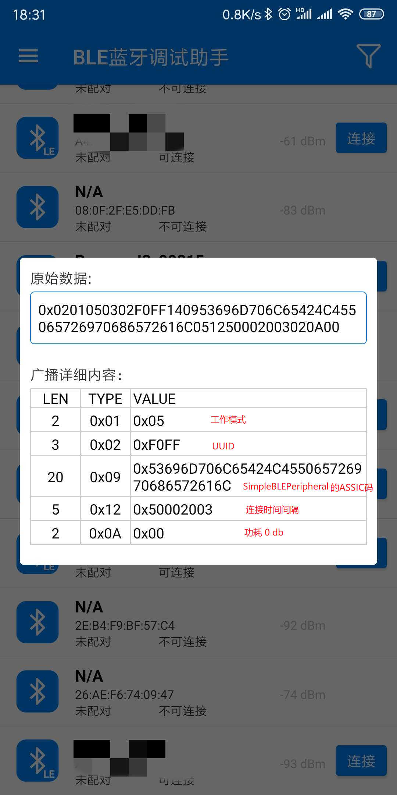
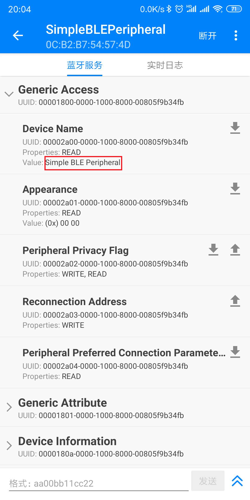
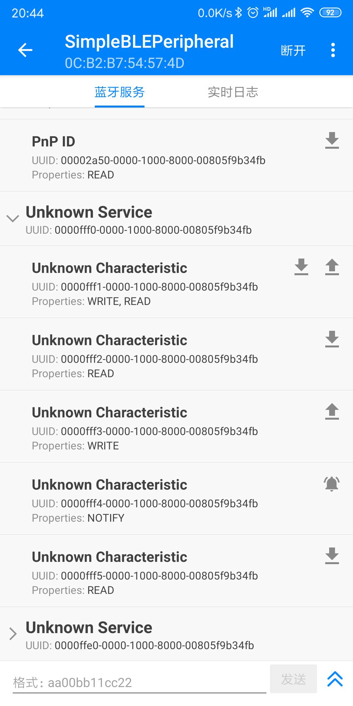

学习蓝牙低功耗，以TI的CC2541开发板作为入门。
安装TI的协议栈SimpleBLEPeripheral源码进行学习。


```
int main(void)
{

	[...省略...]
  /* Initialize the operating system */
  osal_init_system();   // 初始化BLE相关的内容

  /* Enable interrupts */
  HAL_ENABLE_INTERRUPTS();

  // Final board initialization
  InitBoard( OB_READY );

  #if defined ( POWER_SAVING )
    osal_pwrmgr_device( PWRMGR_BATTERY );
  #endif

  /* Start OSAL */
  osal_start_system(); // No Return from here           // 启动BLE协议栈

  return 0;
}
```


```
uint8 osal_init_system( void )
{
	[...省略...]
  // BLE初始化
  // Initialize the system tasks.
  osalInitTasks();

  // Setup efficient search for the first free block of heap.
  osal_mem_kick();

  return ( SUCCESS );
}
```

```
void osalInitTasks( void )
{
[...省略...]
  /* L2CAP Task */
  L2CAP_Init( taskID++ );

  /* GAP Task */
  GAP_Init( taskID++ );

  /* GATT Task */
  GATT_Init( taskID++ );

  /* SM Task */
  SM_Init( taskID++ );

  /* Profiles */
  GAPRole_Init( taskID++ );
  GAPBondMgr_Init( taskID++ );

  GATTServApp_Init( taskID++ );
  // BLE 初始化
  /* Application */
  SimpleBLEPeripheral_Init( taskID );
}
```

#### SimpleBLEPeripheral_Init第一部分，广播部分

```
void SimpleBLEPeripheral_Init( uint8 task_id )
{
  simpleBLEPeripheral_TaskID = task_id;

  // Setup the GAP
  VOID GAP_SetParamValue( TGAP_CONN_PAUSE_PERIPHERAL, DEFAULT_CONN_PAUSE_PERIPHERAL );
  
  // Setup the GAP Peripheral Role Profile
  {
    #if defined( CC2540_MINIDK )
      // CC2540系列，按下按键才会进行广播
      // For the CC2540DK-MINI keyfob, device doesn't start advertising until button is pressed
      uint8 initial_advertising_enable = FALSE;
    #else
      // 其他的直接进行广播
      // For other hardware platforms, device starts advertising upon initialization
      uint8 initial_advertising_enable = TRUE;
    #endif

    // By setting this to zero, the device will go into the waiting state after
    // being discoverable for 30.72 second, and will not being advertising again
    // until the enabler is set back to TRUE
    uint16 gapRole_AdvertOffTime = 0;
    // 升级请求
    uint8 enable_update_request = DEFAULT_ENABLE_UPDATE_REQUEST;
    // 最小连接间隔
    uint16 desired_min_interval = DEFAULT_DESIRED_MIN_CONN_INTERVAL;
    // 最大连接间隔
    uint16 desired_max_interval = DEFAULT_DESIRED_MAX_CONN_INTERVAL;
    // 连接延时
    uint16 desired_slave_latency = DEFAULT_DESIRED_SLAVE_LATENCY;
    // 连接超时时间
    uint16 desired_conn_timeout = DEFAULT_DESIRED_CONN_TIMEOUT;

    // Set the GAP Role Parameters
    // 广播使能？CC2540系列需要按下按键才能进行广播
    GAPRole_SetParameter( GAPROLE_ADVERT_ENABLED, sizeof( uint8 ), &initial_advertising_enable );
    // 广播停止时间?有些限制的广播类型只能广播一定时间，后面就不再广播
    GAPRole_SetParameter( GAPROLE_ADVERT_OFF_TIME, sizeof( uint16 ), &gapRole_AdvertOffTime );
    /* 扫描应答数据，包括名称“SimpleBLEPeripheral”,连接时间间隔，功耗
     * 名称"SimpleBLEPeripheral“就是我们扫面的时候看到的名称
     * 这一部分内容也是包含在广播的原始数据内部
     */
    GAPRole_SetParameter( GAPROLE_SCAN_RSP_DATA, sizeof ( scanRspData ), scanRspData );		// 广播内容，与后面的图片对应
    /* 广播数据
     * 使用APK扫描时，获取的原始数据
     */
    GAPRole_SetParameter( GAPROLE_ADVERT_DATA, sizeof( advertData ), advertData );		// 广播内容，与后面的图片对应
    // 升级请求
    GAPRole_SetParameter( GAPROLE_PARAM_UPDATE_ENABLE, sizeof( uint8 ), &enable_update_request );
    // 最小连接间隔
    GAPRole_SetParameter( GAPROLE_MIN_CONN_INTERVAL, sizeof( uint16 ), &desired_min_interval );
    // 最大连接间隔
    GAPRole_SetParameter( GAPROLE_MAX_CONN_INTERVAL, sizeof( uint16 ), &desired_max_interval );
    // 连接延时时间
    GAPRole_SetParameter( GAPROLE_SLAVE_LATENCY, sizeof( uint16 ), &desired_slave_latency );
    // 连接超时时间
    GAPRole_SetParameter( GAPROLE_TIMEOUT_MULTIPLIER, sizeof( uint16 ), &desired_conn_timeout );
  }

```
介绍一下广播的内容，使用蓝牙调试助手可以查看其中的内容。
```
static uint8 advertData[] =
{
  // Flags; this sets the device to use limited discoverable
  // mode (advertises for 30 seconds at a time) instead of general
  // discoverable mode (advertises indefinitely)
  // 在限制时间内发广播，广播30s之后就搜索不到了。
  0x02,   // length of this data
  GAP_ADTYPE_FLAGS,
  DEFAULT_DISCOVERABLE_MODE | GAP_ADTYPE_FLAGS_BREDR_NOT_SUPPORTED,

  // service UUID, to notify central devices what services are included
  // in this peripheral
  0x03,   // length of this data
  GAP_ADTYPE_16BIT_MORE,      // some of the UUID's, but not all
  LO_UINT16( SIMPLEPROFILE_SERV_UUID ),
  HI_UINT16( SIMPLEPROFILE_SERV_UUID ),

};
```
设备名称，连接时间间隔，功耗等。
```
static uint8 scanRspData[] =
{
  // complete name
  0x14,   // length of this data        // 长度
  GAP_ADTYPE_LOCAL_NAME_COMPLETE,       // 名称
  0x53,   // 'S'
  0x69,   // 'i'
  0x6d,   // 'm'
  0x70,   // 'p'
  0x6c,   // 'l'
  0x65,   // 'e'
  0x42,   // 'B'
  0x4c,   // 'L'
  0x45,   // 'E'
  0x50,   // 'P'
  0x65,   // 'e'
  0x72,   // 'r'
  0x69,   // 'i'
  0x70,   // 'p'
  0x68,   // 'h'
  0x65,   // 'e'
  0x72,   // 'r'
  0x61,   // 'a'
  0x6c,   // 'l'

  // connection interval range
  0x05,   // length of this data
  GAP_ADTYPE_SLAVE_CONN_INTERVAL_RANGE,         // 连接间隔
  LO_UINT16( DEFAULT_DESIRED_MIN_CONN_INTERVAL ),   // 100ms
  HI_UINT16( DEFAULT_DESIRED_MIN_CONN_INTERVAL ),
  LO_UINT16( DEFAULT_DESIRED_MAX_CONN_INTERVAL ),   // 1s
  HI_UINT16( DEFAULT_DESIRED_MAX_CONN_INTERVAL ),

  // Tx power level
  0x02,   // length of this data
  GAP_ADTYPE_POWER_LEVEL,               // 功耗等级
  0       // 0dBm
};

```

内容和下图对应。



####  SimpleBLEPeripheral_Init第二部分，连接之后，显示的内容。

```
  // Set the GAP Characteristics
  // GAP属性设备名称，"Simple BLE Peripheral"，连接以后再GAP的Device Name中可以读取到
  GGS_SetParameter( GGS_DEVICE_NAME_ATT, GAP_DEVICE_NAME_LEN, attDeviceName );

  // Set advertising interval
  {
    // 广播时间间隔
    uint16 advInt = DEFAULT_ADVERTISING_INTERVAL;
    // 最小广播时间间隔，在限制的模式
    GAP_SetParamValue( TGAP_LIM_DISC_ADV_INT_MIN, advInt );
    // 最大广播时间间隔，在限制的模式
    GAP_SetParamValue( TGAP_LIM_DISC_ADV_INT_MAX, advInt );
    // 最小时间间隔，通用模式
    GAP_SetParamValue( TGAP_GEN_DISC_ADV_INT_MIN, advInt );
    // 最大时间间隔，通用模式
    GAP_SetParamValue( TGAP_GEN_DISC_ADV_INT_MAX, advInt );
  }

  // Setup the GAP Bond Manager
  // GAP绑定管理
  {
    uint32 passkey = 0; // passkey "000000"
    uint8 pairMode = GAPBOND_PAIRING_MODE_WAIT_FOR_REQ;
    uint8 mitm = TRUE;
    uint8 ioCap = GAPBOND_IO_CAP_DISPLAY_ONLY;
    uint8 bonding = TRUE;
    // 默认密码
    GAPBondMgr_SetParameter( GAPBOND_DEFAULT_PASSCODE, sizeof ( uint32 ), &passkey );
    // 匹配模式
    GAPBondMgr_SetParameter( GAPBOND_PAIRING_MODE, sizeof ( uint8 ), &pairMode );
    GAPBondMgr_SetParameter( GAPBOND_MITM_PROTECTION, sizeof ( uint8 ), &mitm );
    // IO能力
    GAPBondMgr_SetParameter( GAPBOND_IO_CAPABILITIES, sizeof ( uint8 ), &ioCap );
    // 绑定使能
    GAPBondMgr_SetParameter( GAPBOND_BONDING_ENABLED, sizeof ( uint8 ), &bonding );
  }
  
  // 连接以后，各种特性的初始化
  
  // Initialize GATT attributes
  // GAP属性初始化，添加属性
  GGS_AddService( GATT_ALL_SERVICES );            // GAP
  // GATT属性初始化，添加属性
  GATTServApp_AddService( GATT_ALL_SERVICES );    // GATT attributes
  // 注册Device Information各种属性
  DevInfo_AddService();                           // Device Information Service
```

```
bStatus_t DevInfo_AddService( void )
{
  // Register GATT attribute list and CBs with GATT Server App
  return GATTServApp_RegisterService( devInfoAttrTbl,
                                      GATT_NUM_ATTRS( devInfoAttrTbl ),
                                      &devInfoCBs );
}
```

Device info属性表
```
static gattAttribute_t devInfoAttrTbl[] =
{
  // Device Information Service
  {
    { ATT_BT_UUID_SIZE, primaryServiceUUID }, /* type */
    GATT_PERMIT_READ,                         /* permissions */
    0,                                        /* handle */
    (uint8 *)&devInfoService                /* pValue */
  },

    // System ID Declaration
    {
      { ATT_BT_UUID_SIZE, characterUUID },      // 长度16bit，已经UUID
      GATT_PERMIT_READ,                         // 权限，只读
      0,
      &devInfoSystemIdProps                     // profile名称
    },

      // System ID Value
      {
        { ATT_BT_UUID_SIZE, devInfoSystemIdUUID },
        GATT_PERMIT_READ,
        0,
        (uint8 *) devInfoSystemId
      },

    // Model Number String Declaration
    {
      { ATT_BT_UUID_SIZE, characterUUID },
      GATT_PERMIT_READ,
      0,
      &devInfoModelNumberProps
    },

      // Model Number Value
      {
        { ATT_BT_UUID_SIZE, devInfoModelNumberUUID },
        GATT_PERMIT_READ,
        0,
        (uint8 *) devInfoModelNumber
      },

    // Serial Number String Declaration
    {
      { ATT_BT_UUID_SIZE, characterUUID },
      GATT_PERMIT_READ,
      0,
      &devInfoSerialNumberProps
    },
	[...省略...]
};
```

Device Info 回调函数

```
CONST gattServiceCBs_t devInfoCBs =
{
  // 回调函数
  devInfo_ReadAttrCB, // Read callback function pointer
  NULL,               // Write callback function pointer
  NULL                // Authorization callback function pointer
};
```
读取的时候调用回调函数
```
static uint8 devInfo_ReadAttrCB( uint16 connHandle, gattAttribute_t *pAttr,
                            uint8 *pValue, uint8 *pLen, uint16 offset, uint8 maxLen )
{
  bStatus_t status = SUCCESS;
  uint16 uuid = BUILD_UINT16( pAttr->type.uuid[0], pAttr->type.uuid[1]);
  // 根据UUID判读操作哪个属性, 与属性表中的内容对应
  switch (uuid)
  {
    case DEVINFO_SYSTEM_ID_UUID:
      // verify offset
      // 判断offset是否正确
      if (offset >= sizeof(devInfoSystemId))
      {
        status = ATT_ERR_INVALID_OFFSET;
      }
      else
      {
        // 读取长度
        // determine read length
        *pLen = MIN(maxLen, (sizeof(devInfoSystemId) - offset));
        // 数据保存到pValue中
        // copy data
        osal_memcpy(pValue, &devInfoSystemId[offset], *pLen);
      }
      break;

    case DEVINFO_MODEL_NUMBER_UUID:
      // verify offset
      if (offset >= sizeof(devInfoModelNumber))
      {
        status = ATT_ERR_INVALID_OFFSET;
      }
      else
      {
        // determine read length
        *pLen = MIN(maxLen, (sizeof(devInfoModelNumber) - offset));

        // copy data
        osal_memcpy(pValue, &devInfoModelNumber[offset], *pLen);
      }
      break;

    case DEVINFO_SERIAL_NUMBER_UUID:
      // verify offset
      if (offset >= sizeof(devInfoSerialNumber))
      {
        status = ATT_ERR_INVALID_OFFSET;
      }
      else
      {
        // determine read length
        *pLen = MIN(maxLen, (sizeof(devInfoSerialNumber) - offset));

        // copy data
        osal_memcpy(pValue, &devInfoSerialNumber[offset], *pLen);
      }
      break;

	  [...省略...]

    default:
      *pLen = 0;
      status = ATT_ERR_ATTR_NOT_FOUND;
      break;
  }
  // 返回操作码
  return ( status );
}
```


#### SimpleBLEPeripheral_Init第三部分，用户自定义属性

```
  
  // 注册属性，这个可以用户自己定义的。显示的是“Unknown Service"
  SimpleProfile_AddService( GATT_ALL_SERVICES );  // Simple GATT Profile
#if defined FEATURE_OAD
  VOID OADTarget_AddService();                    // OAD Profile
#endif
  
  // Setup the SimpleProfile Characteristic Values
  // 在刚才的SimpleProfile中再添加5个特性
  {
    uint8 charValue1 = 1;
    uint8 charValue2 = 2;
    uint8 charValue3 = 3;
    uint8 charValue4 = 4;
    uint8 charValue5[SIMPLEPROFILE_CHAR5_LEN] = { 1, 2, 3, 4, 5 };
    // 往定义的特性中，设置对应的值，初值
    SimpleProfile_SetParameter( SIMPLEPROFILE_CHAR1, sizeof ( uint8 ), &charValue1 );
    SimpleProfile_SetParameter( SIMPLEPROFILE_CHAR2, sizeof ( uint8 ), &charValue2 );
    SimpleProfile_SetParameter( SIMPLEPROFILE_CHAR3, sizeof ( uint8 ), &charValue3 );
    SimpleProfile_SetParameter( SIMPLEPROFILE_CHAR4, sizeof ( uint8 ), &charValue4 );
    SimpleProfile_SetParameter( SIMPLEPROFILE_CHAR5, SIMPLEPROFILE_CHAR5_LEN, charValue5 );
  }


[...省略...]

  // Register callback with SimpleGATTprofile
  // 注册SimpleGATTprofile的回调函数
  VOID SimpleProfile_RegisterAppCBs( &simpleBLEPeripheral_SimpleProfileCBs );

  // Enable clock divide on halt
  // This reduces active current while radio is active and CC254x MCU
  // is halted
  HCI_EXT_ClkDivOnHaltCmd( HCI_EXT_ENABLE_CLK_DIVIDE_ON_HALT );

  // Setup a delayed profile startup
  osal_set_event( simpleBLEPeripheral_TaskID, SBP_START_DEVICE_EVT );

}
```

```
bStatus_t SimpleProfile_AddService( uint32 services )
{
  uint8 status = SUCCESS;

  // Initialize Client Characteristic Configuration attributes
  GATTServApp_InitCharCfg( INVALID_CONNHANDLE, simpleProfileChar4Config );

  // Register with Link DB to receive link status change callback
  VOID linkDB_Register( simpleProfile_HandleConnStatusCB );  
  
  if ( services & SIMPLEPROFILE_SERVICE )
  {
    // 注册属性，和回调函数
    // Register GATT attribute list and CBs with GATT Server App
    status = GATTServApp_RegisterService( simpleProfileAttrTbl, 
                                          GATT_NUM_ATTRS( simpleProfileAttrTbl ),
                                          &simpleProfileCBs );
  }

  return ( status );
}
```
属性表
```
static gattAttribute_t simpleProfileAttrTbl[SERVAPP_NUM_ATTR_SUPPORTED] = 
{
  // Simple Profile Service
  { 
    { ATT_BT_UUID_SIZE, primaryServiceUUID }, /* type */
    GATT_PERMIT_READ,                         /* permissions */
    0,                                        /* handle */
    (uint8 *)&simpleProfileService            /* pValue */
  },
  
    // Characteristic 1 Declaration
    // 特性1申明
    { 
      { ATT_BT_UUID_SIZE, characterUUID },
      GATT_PERMIT_READ, 
      0,
      &simpleProfileChar1Props 
    },
      // 特性1的值
      // Characteristic Value 1
      { 
        { ATT_BT_UUID_SIZE, simpleProfilechar1UUID },
        GATT_PERMIT_READ | GATT_PERMIT_WRITE, 
        0, 
        &simpleProfileChar1 
      },

      // Characteristic 1 User Description
      { 
        { ATT_BT_UUID_SIZE, charUserDescUUID },
        GATT_PERMIT_READ, 
        0, 
        simpleProfileChar1UserDesp 
      },      

    // Characteristic 2 Declaration
    { 
      { ATT_BT_UUID_SIZE, characterUUID },
      GATT_PERMIT_READ, 
      0,
      &simpleProfileChar2Props 
    },

      // Characteristic Value 2
      { 
        { ATT_BT_UUID_SIZE, simpleProfilechar2UUID },
        GATT_PERMIT_READ, 
        0, 
        &simpleProfileChar2 
      },
```

回调函数

```
// Simple Profile Service Callbacks
CONST gattServiceCBs_t simpleProfileCBs =
{
  // 读回调函数
  simpleProfile_ReadAttrCB,  // Read callback function pointer
  // 写回调函数
  simpleProfile_WriteAttrCB, // Write callback function pointer
  NULL                       // Authorization callback function pointer
};
```

回调函数读操作

```
static uint8 simpleProfile_ReadAttrCB( uint16 connHandle, gattAttribute_t *pAttr, 
                            uint8 *pValue, uint8 *pLen, uint16 offset, uint8 maxLen )
{
  bStatus_t status = SUCCESS;

  // If attribute permissions require authorization to read, return error
  if ( gattPermitAuthorRead( pAttr->permissions ) )
  {
    // Insufficient authorization
    return ( ATT_ERR_INSUFFICIENT_AUTHOR );
  }
  
  // Make sure it's not a blob operation (no attributes in the profile are long)
  if ( offset > 0 )
  {
    return ( ATT_ERR_ATTR_NOT_LONG );
  }
 
  if ( pAttr->type.len == ATT_BT_UUID_SIZE )
  {
    // 16-bit UUID
    uint16 uuid = BUILD_UINT16( pAttr->type.uuid[0], pAttr->type.uuid[1]);
    switch ( uuid )
    {
      // No need for "GATT_SERVICE_UUID" or "GATT_CLIENT_CHAR_CFG_UUID" cases;
      // gattserverapp handles those reads

      // characteristics 1 and 2 have read permissions
      // characteritisc 3 does not have read permissions; therefore it is not
      //   included here
      // characteristic 4 does not have read permissions, but because it
      //   can be sent as a notification, it is included here
      case SIMPLEPROFILE_CHAR1_UUID:
      case SIMPLEPROFILE_CHAR2_UUID:
      case SIMPLEPROFILE_CHAR4_UUID:
        *pLen = 1;
        pValue[0] = *pAttr->pValue;
        break;

      case SIMPLEPROFILE_CHAR5_UUID:
        *pLen = SIMPLEPROFILE_CHAR5_LEN;
        VOID osal_memcpy( pValue, pAttr->pValue, SIMPLEPROFILE_CHAR5_LEN );
        break;
        
      default:
        // Should never get here! (characteristics 3 and 4 do not have read permissions)
        *pLen = 0;
        status = ATT_ERR_ATTR_NOT_FOUND;
        break;
    }
  }
  else
  {
    // 128-bit UUID
    *pLen = 0;
    status = ATT_ERR_INVALID_HANDLE;
  }

  return ( status );
}
```
回调函数写操作
```
static bStatus_t simpleProfile_WriteAttrCB( uint16 connHandle, gattAttribute_t *pAttr,
                                 uint8 *pValue, uint8 len, uint16 offset )
{
  bStatus_t status = SUCCESS;
  uint8 notifyApp = 0xFF;
  
  // If attribute permissions require authorization to write, return error
  if ( gattPermitAuthorWrite( pAttr->permissions ) )
  {
    // Insufficient authorization
    return ( ATT_ERR_INSUFFICIENT_AUTHOR );
  }
  
  if ( pAttr->type.len == ATT_BT_UUID_SIZE )
  {
    // 16-bit UUID
    uint16 uuid = BUILD_UINT16( pAttr->type.uuid[0], pAttr->type.uuid[1]);
    switch ( uuid )
    {
      case SIMPLEPROFILE_CHAR1_UUID:
      case SIMPLEPROFILE_CHAR3_UUID:

        //Validate the value
        // Make sure it's not a blob oper
        if ( offset == 0 )
        {
          if ( len != 1 )
          {
            status = ATT_ERR_INVALID_VALUE_SIZE;
          }
        }
        else
        {
          status = ATT_ERR_ATTR_NOT_LONG;
        }
        
        //Write the value
        if ( status == SUCCESS )
        {
          uint8 *pCurValue = (uint8 *)pAttr->pValue;        
          *pCurValue = pValue[0];

          if( pAttr->pValue == &simpleProfileChar1 )
          {
            notifyApp = SIMPLEPROFILE_CHAR1;        
          }
          else
          {
            notifyApp = SIMPLEPROFILE_CHAR3;           
          }
        }
             
        break;

      case GATT_CLIENT_CHAR_CFG_UUID:
        status = GATTServApp_ProcessCCCWriteReq( connHandle, pAttr, pValue, len,
                                                 offset, GATT_CLIENT_CFG_NOTIFY );
        break;
        
      default:
        // Should never get here! (characteristics 2 and 4 do not have write permissions)
        status = ATT_ERR_ATTR_NOT_FOUND;
        break;
    }
  }
  else
  {
    // 128-bit UUID
    status = ATT_ERR_INVALID_HANDLE;
  }

  // If a charactersitic value changed then callback function to notify application of change
  if ( (notifyApp != 0xFF ) && simpleProfile_AppCBs && simpleProfile_AppCBs->pfnSimpleProfileChange )
  {
    simpleProfile_AppCBs->pfnSimpleProfileChange( notifyApp );  
  }
  // 返回是否写入成功
  return ( status );
}
```

添加参数，并设置初值。

```
bStatus_t SimpleProfile_SetParameter( uint8 param, uint8 len, void *value )
{
  bStatus_t ret = SUCCESS;
  // 判断是那个特性需要写入数据
  switch ( param )
  {
    case SIMPLEPROFILE_CHAR1:
      if ( len == sizeof ( uint8 ) ) 
      {
        simpleProfileChar1 = *((uint8*)value);
      }
      else
      {
        ret = bleInvalidRange;
      }
      break;

    case SIMPLEPROFILE_CHAR2:
      if ( len == sizeof ( uint8 ) ) 
      {
        simpleProfileChar2 = *((uint8*)value);
      }
      else
      {
        ret = bleInvalidRange;
      }
      break;

    case SIMPLEPROFILE_CHAR3:
      if ( len == sizeof ( uint8 ) ) 
      {
        simpleProfileChar3 = *((uint8*)value);
      }
      else
      {
        ret = bleInvalidRange;
      }
      break;

    case SIMPLEPROFILE_CHAR4:
      if ( len == sizeof ( uint8 ) ) 
      {
        simpleProfileChar4 = *((uint8*)value);
        
        // See if Notification has been enabled
        GATTServApp_ProcessCharCfg( simpleProfileChar4Config, &simpleProfileChar4, FALSE,
                                    simpleProfileAttrTbl, GATT_NUM_ATTRS( simpleProfileAttrTbl ),
                                    INVALID_TASK_ID );
      }
      else
      {
        ret = bleInvalidRange;
      }
      break;

    case SIMPLEPROFILE_CHAR5:
      if ( len == SIMPLEPROFILE_CHAR5_LEN ) 
      {
        VOID osal_memcpy( simpleProfileChar5, value, SIMPLEPROFILE_CHAR5_LEN );
      }
      else
      {
        ret = bleInvalidRange;
      }
      break;
      
    default:
      ret = INVALIDPARAMETER;
      break;
  }
  
  return ( ret );
}
```


