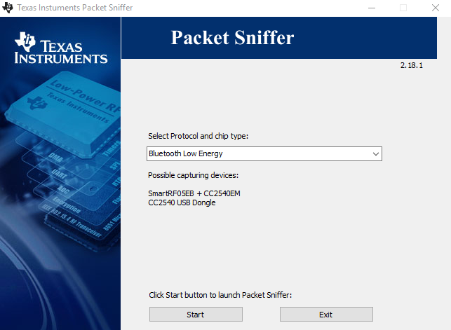
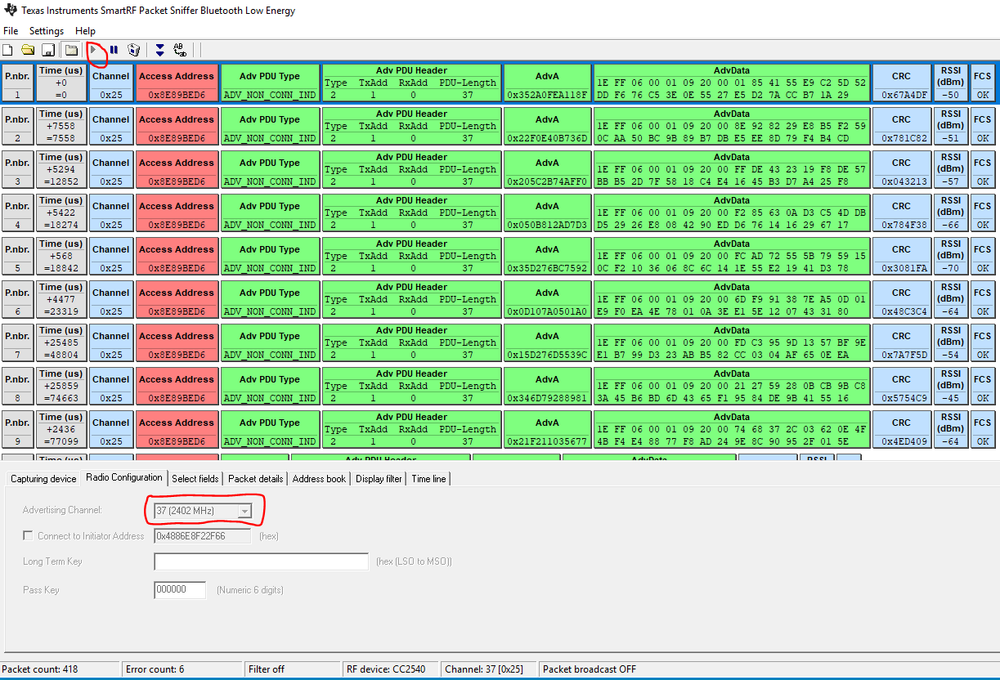
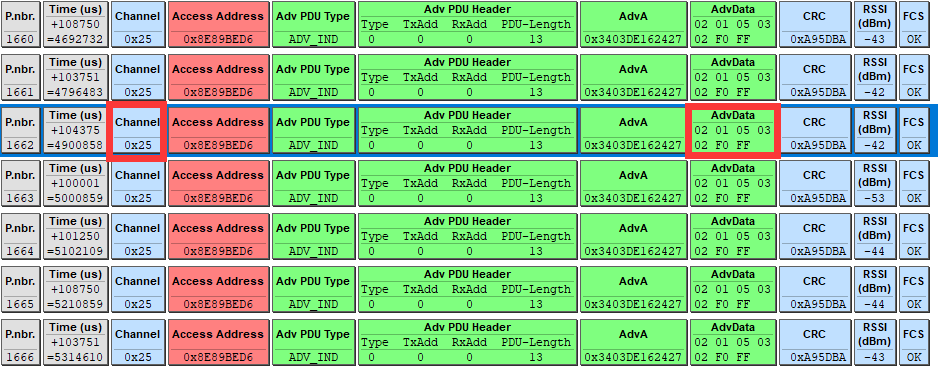
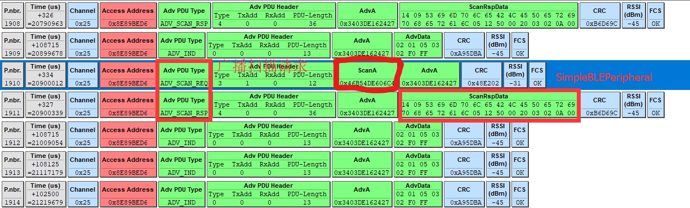
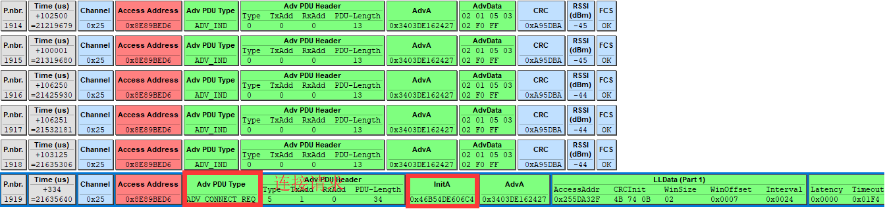
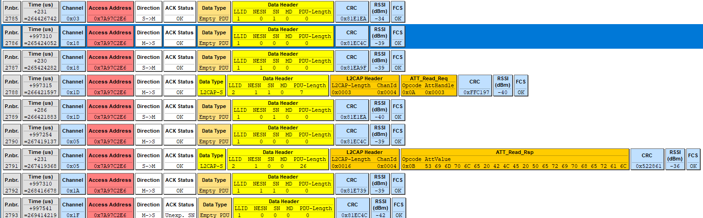

## 参考链接

* [如何使用CC2540 USB-Dongle进行抓取蓝牙通讯数据包](https://blog.csdn.net/zhuangjitongxue/article/details/49337445)

* [cc2540 usb-dongle的 SmartRF Packet Sniffer 抓取数据方法](https://blog.csdn.net/huibei_wuhan/article/details/79004311)

## 数据分析

插上CC2540 USB Dongle。打开Packet sniffer工具，选择Bluetooth Low Energy。



选择合适的广播信道，启动Packet sniffer工具。可能需要切换广播信道才可以接受到广播。

不勾选的话，捕抓工具将捕抓当前通道上第一个出现的数据连接, 我觉得不勾选反而更容易抓到数据。



广播包内容如下。



显示了当前广播的通道号0x25(37信道)， 以及广播的数据内容，这一部分内容，与代码中对应。

```
static uint8 advertData[] =
{
  // Flags; this sets the device to use limited discoverable
  // mode (advertises for 30 seconds at a time) instead of general
  // discoverable mode (advertises indefinitely)
  0x02,   // length of this data
  GAP_ADTYPE_FLAGS,
  DEFAULT_DISCOVERABLE_MODE | GAP_ADTYPE_FLAGS_BREDR_NOT_SUPPORTED,

  // service UUID, to notify central devices what services are included
  // in this peripheral
  0x03,   // length of this data
  GAP_ADTYPE_16BIT_MORE,      // some of the UUID's, but not all
  LO_UINT16( SIMPLEPROFILE_SERV_UUID ),
  HI_UINT16( SIMPLEPROFILE_SERV_UUID ),

};
```

手机的扫描请求和应答的数据格式如下。



扫描应答的数据内容和一下代码对应。

```
static uint8 scanRspData[] =
{
  // complete name
  0x14,   // length of this data        // 长度
  GAP_ADTYPE_LOCAL_NAME_COMPLETE,       // 名称
  0x53,   // 'S'
  0x69,   // 'i'
  0x6d,   // 'm'
  0x70,   // 'p'
  0x6c,   // 'l'
  0x65,   // 'e'
  0x42,   // 'B'
  0x4c,   // 'L'
  0x45,   // 'E'
  0x50,   // 'P'
  0x65,   // 'e'
  0x72,   // 'r'
  0x69,   // 'i'
  0x70,   // 'p'
  0x68,   // 'h'
  0x65,   // 'e'
  0x72,   // 'r'
  0x61,   // 'a'
  0x6c,   // 'l'

  // connection interval range
  0x05,   // length of this data
  GAP_ADTYPE_SLAVE_CONN_INTERVAL_RANGE,         // 连接间隔
  LO_UINT16( DEFAULT_DESIRED_MIN_CONN_INTERVAL ),   // 100ms
  HI_UINT16( DEFAULT_DESIRED_MIN_CONN_INTERVAL ),
  LO_UINT16( DEFAULT_DESIRED_MAX_CONN_INTERVAL ),   // 1s
  HI_UINT16( DEFAULT_DESIRED_MAX_CONN_INTERVAL ),

  // Tx power level
  0x02,   // length of this data
  GAP_ADTYPE_POWER_LEVEL,               // 功耗等级
  0       // 0dBm
};
```

当使用手机的BLE工具与CC2540开发板连接，可以看到连接请求数据帧如下。



可以发现ScanA的内容和InitA的内容是一样的。可以将这个地址填写到Connected to Initator Address，作为过滤选项。

连接以后就可以进行数据通信，抓取通信过程的数据包。


